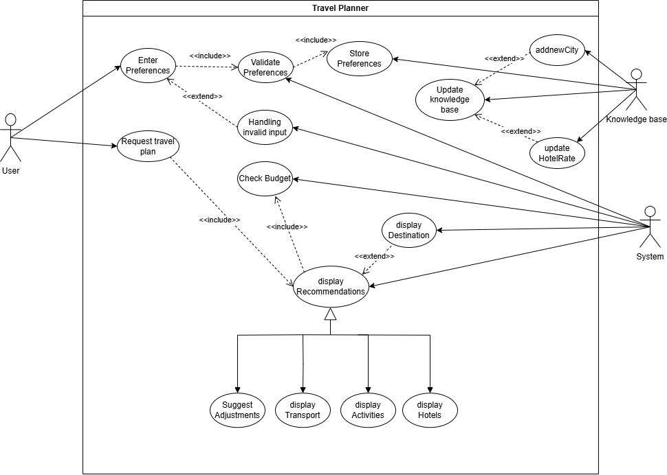
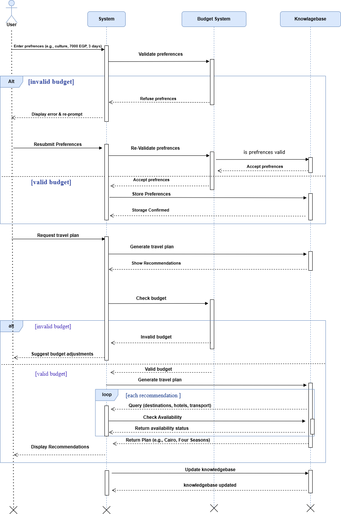
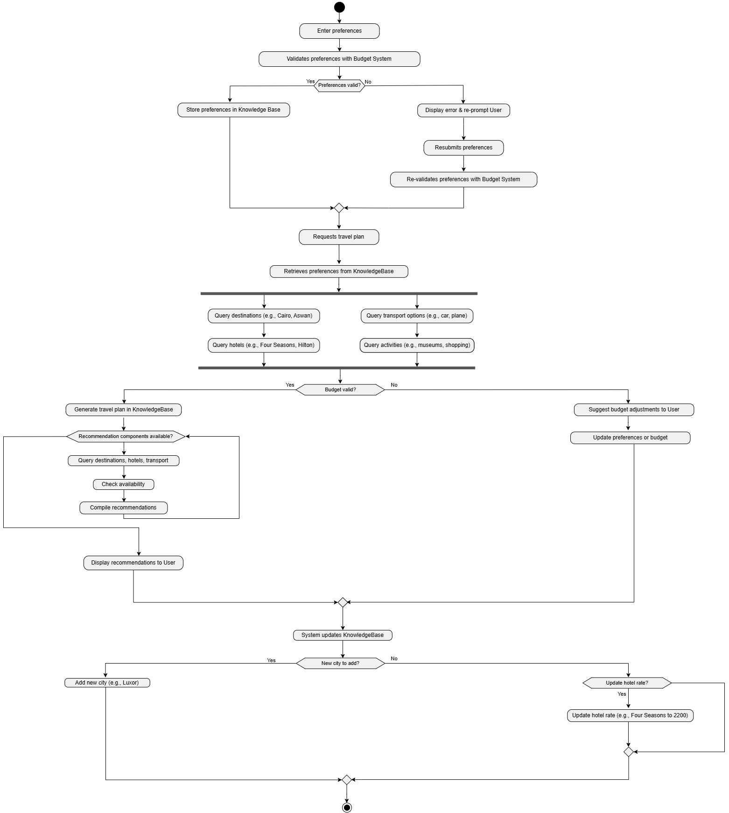

# Logic-based Travel Planner 🚀

**Welcome to the Logic-based Travel Planner**, an innovative solution leveraging **Prolog** to revolutionize travel planning with personalized, budget-friendly itineraries. Developed by the *TravelLogic Crew* for the *Logic Programming Course* at **Modern University for Technology & Information**, this mid-term project showcases modern logic programming techniques applied to real-world challenges.

---

## 🌟 Project Overview

The **Logic-based Travel Planner** automates travel planning by integrating **budget estimation**, **hotel recommendations**, **destination insights**, **transportation assistance**, and **activity discovery**. Built with **Prolog’s declarative programming**, it offers a scalable, rule-based system that adapts to user preferences and constraints, transforming a traditionally tedious process into an efficient experience.

---

## 📋 Table of Contents

- [Problem Definition](#-problem-definition)
- [Project Description](#-project-description)
  - [Introduction](#-introduction)
  - [Technical Approach](#-technical-approach)
    - [System Components](#-system-components)
    - [Technical Features](#-technical-features)
    - [Design Principles](#-design-principles)
- [Diagrams](#-diagrams)
  - [Use Case Diagram](#-use-case-diagram)
  - [Sequence Diagram](#-sequence-diagram)
  - [Activity Diagram](#-activity-diagram)
- [Prolog Implementation](#-prolog-implementation)
- [Conclusion](#-conclusion)
- [References](#-references)
- [How to Contribute](#-how-to-contribute)
- [License](#-license)

---

## 🧩 Problem Definition

Before **logic-based systems** like *Prolog*, travel planning was a daunting task. Travelers struggled with **trustworthy recommendations**, **accurate budgeting**, and accessing **destination details** (e.g., landmarks, cultural sites). Upon arrival, challenges like selecting **budget-friendly hotels**, arranging **transportation**, and planning **activities** (e.g., shopping, cinema, museum tours) added complexity. The **Logic-based Travel Planner** addresses these pain points with an **automated**, *intelligent framework* that optimizes decision-making and enhances the travel experience.

---

## 📝 Project Description

### Introduction

The **Logic-based Travel Planner** redefines travel planning with **customized itineraries** powered by **Prolog**. Designed for the *Logic Programming Course*, it calculates **budgets**, recommends **hotels**, and provides **destination insights**, all while ensuring a *seamless* user experience. Future iterations will introduce a **GUI** and **real-time data integration**, aligning with modern travel tech trends.

### Technical Approach

A **rule-based expert system** built with **Prolog**, this project tackles the *complexity* of travel planning with precision and scalability.

#### System Components

- **Knowledge Base**:  
  - `city/1`: e.g., `cairo`, `aswan`.  
  - `attraction/2`: e.g., `attraction(cairo, pyramids)`.  
  - `hotel/4`: e.g., `hotel(cairo, 'four_seasons', 2000, 4.8)`.  
  - `transport/3`: e.g., `transport(cairo, car, 500)`.  
  - `activity/3`: e.g., `activity(cairo, shopping, 300)`.  
  - *Scalable* with modular design for future enhancements (e.g., user reviews).

- **Inference Engine**:  
  - Uses **Prolog’s unification** and *backtracking* for efficient rule execution.

- **Interface Layer**:  
  - Current **CLI**; future **GUI** planned.

#### Technical Features

1. **Budget Estimation**: Aggregates costs (hotel, transport, food, activities).  
   - Example: `2000 * 3 + 500 + (300 * 3) = 6800 EGP` for a 3-day Cairo trip.
2. **Hotel Recommendations**: Filters `hotel/4` by budget and `Rating` (e.g., ≥ 4.2).
3. **Destination Information**: Queries `attraction/2` for landmarks and cultural sites.
4. **Transportation Assistance**: Matches `transport/3` to cities with cost optimization.
5. **Personalized Recommendations**: Uses `personalized_recommendation/4` for tailored plans.
6. **Activity Discovery**: Maps `activity/3` to user interests.

#### Design Principles

- **Modularity**: Independent facts and rules for easy updates.
- **Efficiency**: *Polynomial-time* performance via Prolog backtracking.
- **Scalability**: Ready for *real-time data* and *multi-user support*.
- **Reliability**: Robust input validation and constraint checking.

---

## 📊 Diagrams

### Use Case Diagram

Visualizes the system’s **functional requirements** and actor interactions.

- **Actors**: **User**, **System**, **Knowledge Base**.
- **Primary Use Cases**: **Enter Preferences**, **Request Travel Plan**, **Show Recommendations**, **Update Knowledge Base**.
- **Extended Use Cases**: **Handling Invalid Input**, **Suggest Adjustments**.

### Sequence Diagram

Depicts the **dynamic interactions** over time.

- **Actors**: **User**, **System**, **Budget System**, **Knowledge Base**.
- **Flow**: Entering preferences, requesting plans, budget checking, and updates.
- **Controls**: `Alt` for invalid budgets, `Loop` for recommendations.

### Activity Diagram

Models the **procedural workflow**.

- **Flow**: From entering preferences to displaying recommendations, with budget validation and knowledge base updates.
- **Controls**: Decision points (e.g., "Budget valid?"), loops (e.g., query iterations).

---

## 🎯 Conclusion
The Logic-based Travel Planner is a pioneering effort in logic programming, delivering a scalable, user-centric system. This mid-term showcases Prolog’s power in handling travel planning complexities, with diagrams illustrating its adaptability. Future plans include a GUI, real-time data, and multi-user support, positioning it as a leader in intelligent travel tech.

---

## 📚 References
- Booch, G., Rumbaugh, J., & Jacobson, I. (2005). The Unified Modeling Language User Guide (2nd ed.). Addison-Wesley.
- Bratko, I. (2012). Prolog Programming for Artificial Intelligence (4th ed.). Addison-Wesley.
- Object Management Group (OMG). (2023). UML Specification, Version 2.5.1. https://www.omg.org/spec/UML/2.5.1
- SWI-Prolog. (2023). Documentation. https://www.swi-prolog.org/
- Sommerville, I. (2015). Software Engineering (10th ed.). Pearson.

---

## 📜 License
This project is licensed under the MIT License.
